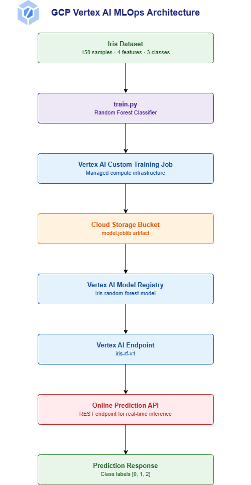

# GCP Vertex AI MLOps Project
## End-to-End Model Training, Registration, Deployment, and Prediction using Vertex AI

---

# Project Overview

This project demonstrates a complete MLOps workflow using Google Cloud Vertex AI.

The project trains a Machine Learning model using the Iris dataset, registers the trained model in Vertex AI Model Registry, deploys it to a Vertex AI Endpoint, performs online predictions, and verifies the complete deployment lifecycle.

The implementation uses:

- Google Cloud Platform (GCP)
- Vertex AI
- Cloud Storage
- Cloud Shell
- Scikit-Learn
- Python

---

# Project Objective

The objective of this project is to understand and implement a complete MLOps lifecycle on Google Cloud Vertex AI.

The workflow includes:

- Dataset Preparation
- Model Training
- Model Artifact Storage
- Model Registration
- Endpoint Deployment
- Online Prediction
- Resource Cleanup

This project simulates a real-world machine learning deployment pipeline using managed cloud services.

---

# Architecture Diagram



---

# Solution Architecture

The workflow follows the sequence below:

1. Iris Dataset is loaded.
2. Random Forest model is trained using Scikit-Learn.
3. Vertex AI Custom Training Job executes training.
4. Model artifact (model.joblib) is generated.
5. Artifact is stored in Cloud Storage.
6. Model is registered in Vertex AI Model Registry.
7. Model is deployed to a Vertex AI Endpoint.
8. Endpoint serves real-time predictions.
9. Prediction responses are returned to the client.

---

# Technologies Used

| Service | Purpose |
|----------|----------|
| Vertex AI | Model Training and Deployment |
| Cloud Storage | Model Artifact Storage |
| Cloud Shell | Development Environment |
| Scikit-Learn | Machine Learning Framework |
| Python | Programming Language |
| GitHub | Source Code Management |

---

# Prerequisites

Before starting this project ensure that:

- Google Cloud Account is available
- Billing is enabled
- Vertex AI API access is available
- Cloud Storage API access is available
- Artifact Registry API access is available
- Cloud Shell access is available

Region used:

```text
us-central1
```

---

# Project Structure

```text
gcp-vertex-ml-lab/

├── train.py
├── run_vertex_lab.py
├── predict.py
├── README.md
└── 03-architecture-diagram.png
```

---

# File Description

## train.py

Responsible for:

- Loading Iris Dataset
- Splitting dataset
- Training Random Forest model
- Evaluating model accuracy
- Saving model.joblib
- Uploading model artifact to Cloud Storage

---

## run_vertex_lab.py

Responsible for:

- Creating Vertex AI Custom Training Job
- Running model training
- Registering model in Vertex AI Model Registry
- Deploying model to Vertex AI Endpoint
- Running prediction test

---

## predict.py

Responsible for:

- Connecting to deployed endpoint
- Sending prediction request
- Displaying prediction response

---

# Step 1: Select Project and Open Cloud Shell

## Console Navigation

1. Open Google Cloud Console
2. Select your project
3. Click Cloud Shell icon
4. Wait for Cloud Shell terminal to start

Verify Project:

```bash
PROJECT_ID=$(gcloud config get-value project)

echo $PROJECT_ID
```

Expected Output:

```text
your-project-id
```

---

# Step 2: Configure Project Variables

Run:

```bash
PROJECT_ID=$(gcloud config get-value project)

REGION=us-central1

BUCKET=${PROJECT_ID}-vertex-ml-lab-$RANDOM

export PROJECT_ID
export REGION
export BUCKET
```

Verify:

```bash
echo $PROJECT_ID

echo $REGION

echo $BUCKET
```

Expected Output:

```text
PROJECT_ID=your-project-id

REGION=us-central1

BUCKET=your-project-id-vertex-ml-lab-xxxxx
```

---

# Step 3: Enable Required APIs

Run:

```bash
gcloud services enable \
aiplatform.googleapis.com \
storage.googleapis.com \
artifactregistry.googleapis.com
```

Required APIs:

- Vertex AI API
- Cloud Storage API
- Artifact Registry API

---

# Step 4: Create Cloud Storage Bucket

Run:

```bash
gsutil mb -l $REGION gs://$BUCKET
```

Verify:

```bash
gsutil ls
```

Expected:

```text
gs://your-project-id-vertex-ml-lab-xxxxx/
```

---

# Step 5: Create Project Folder

Run:

```bash
mkdir -p gcp-vertex-ml-lab

cd gcp-vertex-ml-lab
```

Verify:

```bash
pwd
```

Expected:

```text
/home/username/gcp-vertex-ml-lab
```

---

# Step 6: Create Training Script

Create file:

```bash
touch train.py
```

Purpose:

The script:

- Loads Iris dataset
- Splits data
- Trains Random Forest model
- Evaluates accuracy
- Saves model artifact
- Uploads model.joblib to Cloud Storage

Verify:

```bash
cat train.py
```

---

# Step 7: Create Vertex AI Runner Script

Create file:

```bash
touch run_vertex_lab.py
```

Purpose:

The script:

- Creates Vertex AI Custom Training Job
- Registers model
- Deploys endpoint
- Tests online prediction

Verify:

```bash
cat run_vertex_lab.py
```

---

# Step 8: Install Vertex AI SDK

Run:

```bash
python3 -m pip install --user --upgrade google-cloud-aiplatform
```

Verify:

```bash
python3 -c "from google.cloud import aiplatform; print('Vertex AI SDK Ready')"
```

Expected:

```text
Vertex AI SDK Ready
```

---

# Step 9: Execute Complete Vertex AI Workflow

Run:

```bash
python3 run_vertex_lab.py
```

This performs:

- Custom Training Job Creation
- Model Training
- Artifact Generation
- Artifact Upload
- Model Registration
- Endpoint Creation
- Endpoint Deployment
- Prediction Test

Expected Output:

```text
Training completed

Deployment completed

Prediction response

Prediction(predictions=[...])
```

Save:

```text
MODEL_ID

ENDPOINT_ID

BUCKET
```

---

# Step 10: Verify Training Job

Run:

```bash
gcloud ai custom-jobs list --region=$REGION
```

Expected:

```text
JOB_STATE_SUCCEEDED
```

Verification:

- Training Job Exists
- Status = Successful

---

# Step 11: Verify Model Registry

Run:

```bash
gcloud ai models list --region=$REGION
```

Expected:

```text
iris-random-forest-model
```

Verification:

- Model Registered Successfully
- Model Version Created

---

# Step 12: Verify Endpoint Deployment

Run:

```bash
gcloud ai endpoints list --region=$REGION
```

Expected:

```text
iris-random-forest-model_endpoint
```

Verification:

- Endpoint Exists
- Deployment Successful

---

# Step 13: Verify Storage Artifacts

Run:

```bash
gsutil ls -r gs://$BUCKET
```

Expected:

```text
vertex-output/model/model.joblib
```

Verification:

- Model Artifact Available
- Upload Successful

---

# Step 14: Prediction Testing

Run:

```bash
python3 predict.py
```

Provide:

```text
ENDPOINT_ID
```

Example Input:

```text
4902054394939310080
```

Expected Output:

```text
Prediction(predictions=[...])
```

---

# Project Results

Successfully Completed:

- Vertex AI Custom Training Job
- Model Training
- Artifact Storage
- Model Registry Registration
- Endpoint Deployment
- Online Prediction

Generated Resources:

- model.joblib
- Vertex AI Model
- Vertex AI Endpoint
- Cloud Storage Artifacts

Region:

```text
us-central1
```

---

# Screenshots

Add screenshots inside a folder named:

```text
screenshots/
```

Suggested Structure:

```text
screenshots/

01-project-overview.png
02-project-configuration.png
03-api-enablement.png
04-storage-bucket.png
05-train-script.png
06-run-script-part1.png
07-run-script-part2.png
08-training-job.png
09-model-registry.png
10-endpoint-deployment.png
11-storage-artifact.png
12-prediction-test.png
```

---

# Cleanup

## Get Endpoint

```bash
gcloud ai endpoints list --region=$REGION
```

---

## Get Deployed Model

```bash
DEPLOYED_MODEL_ID=$(gcloud ai endpoints describe $ENDPOINT_ID \
--region=$REGION \
--format='value(deployedModels.id)')
```

---

## Undeploy Model

```bash
gcloud ai endpoints undeploy-model $ENDPOINT_ID \
--region=$REGION \
--deployed-model-id=$DEPLOYED_MODEL_ID
```

---

## Delete Endpoint

```bash
gcloud ai endpoints delete $ENDPOINT_ID \
--region=$REGION \
--quiet
```

---

## Delete Model

```bash
gcloud ai models delete $MODEL_ID \
--region=$REGION \
--quiet
```

---

## Delete Storage Bucket

```bash
gsutil -m rm -r gs://$BUCKET
```

---

# Troubleshooting

## API Not Enabled

Run:

```bash
gcloud services enable \
aiplatform.googleapis.com \
storage.googleapis.com \
artifactregistry.googleapis.com
```

---

## Bucket Already Exists

Create new bucket:

```bash
BUCKET=${PROJECT_ID}-vertex-ml-lab-$RANDOM

export BUCKET
```

---

## Project Not Set

Check:

```bash
gcloud config get-value project
```

Set:

```bash
gcloud config set project YOUR_PROJECT_ID
```

---

## Deployment Taking Long Time

Check:

```bash
gcloud ai endpoints list --region=$REGION
```

---

## Model Artifact Missing

Check:

```bash
gsutil ls -r gs://$BUCKET
```

Expected:

```text
model.joblib
```

---

# Future Enhancements

- Vertex AI Pipelines
- CI/CD Integration
- Cloud Build Automation
- Terraform Infrastructure
- Model Monitoring
- Feature Store Integration
- Automated Retraining Pipeline

---

# Author

Gnaneshwar Sreepathi

Project: GCP Vertex AI MLOps Project

Platform: Google Cloud Vertex AI

Year: 2026
